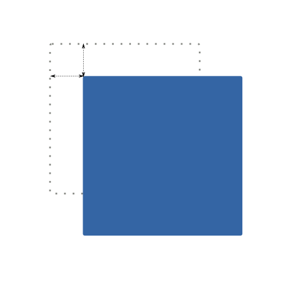
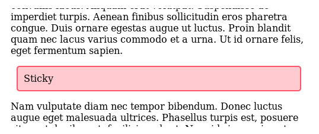

# CSS layout

CSS page layout techniques allow us to take elements contained in a web page and control where they are positioned relative to their default position in normal layout flow.

## Default layout flow: inline vs. block

Normal flow is how the browser lays out HTML pages by default when you do nothing to control page layout.
The elements that appear one below the other are described as *block elements*, in contrast to *inline elements*, which appear one beside the other, like the individual words in a paragraph.

### Block

By default, a block level element's content is 100% of the width of its parent element, and as tall as its content. Each one will appear on a new line below the last one, and they will be separated by any margin that is set on them (defauylt margin or any margin we set on CSS).

```html
<h1>Basic document flow</h1>
<p>I am a basic block level element. My adjacent block level elements sit on new lines below me.</p>
<p>By default we span 100% of the width of our parent element, and we are as tall as our child content. Our total width and height is our content + padding + border width/height.</p>
```

All this elements will appear on a different lines. Each one will sit in top of the other.

### Inline

Inline elements are as tall as their content, and as wide as their content.
Inline elements don't appear on new lines as block elements; instead, they sit on the same line as one another, as long as there is space for them to do so inside the width of the parent block level element. If there isn't space, then the overflowing text or elements will move down to a new line.

```html
<p><strong>By default we span 100% of the width of our parent element</strong>, <span>and we are as tall</span> <cite>as our child content.</cite> <em>Our total width and height</em> <a href="#">is our content + padding + border width/height.</a></p>
```

All this elements will appear on the same line inside the block element `<p>`

## Positioning

Positioning allows you to take elements out of the normal document layout flow, and make them behave differently; for example sitting on top of one another, or always remaining in the same place inside the browser viewport.

### Static

This is the default value.

> The element is positioned according to the normal flow of the document. The top, right, bottom, left, and z-index properties have no effect.

### Relative

> The element is positioned according to the normal flow of the document, and then offset relative to itself based on the values of top, right, bottom, and left. *The offset does not affect the position of any other elements*; thus, the space given for the element in the page layout is the same as if position were static.

This is very similar to static positioning, except that once the positioned element has taken its place in the normal layout flow, you can then modify its final position, including making it overlap other elements on the page.

`top`, `bottom`, `left`, and `right` are used alongside position to specify exactly where to move the positioned element to.

```css
.box {
    position: relative;
    top: 5px;
    left: 5px;
}
```



### Absolute

> The element is removed from the normal document flow, and no space is created for the element in the page layout. An absolutely positioned element no longer exists in the normal document layout flow. Instead, it sits on its own layer separate from everything else. This is very useful: it means that we can create isolated UI features that don't interfere with the position of other elements on the page. For example: popups, dialogs, floating menus...etc.

`top`, `bottom`, `left`, and `right` are used alongside position to specify exactly where to move the positioned element to.

*IMPORTANT: The box will be positioned relative to its closest positioned ancestor*, if any. What is a positioned ancestor? The nearest ancestor element that has a position value other than static (fixed, absolute, relative, or sticky). If no ancestor elements have their position property explicitly defined the box will be positioned relatively to the html element.

```css
.box {
  position: absolute;
  background: yellow;
  top: 30px;
  left: 30px;
}
```


### Fixed

> The element is removed from the normal document flow, and no space is created for the element in the page layout. It is positioned relative to the initial containing block. Its final position is determined by the values of top, right, bottom, and left.

This works in exactly the same way as absolute positioning, with one key difference: whereas absolute positioning fixes an element in place relative to the `<html>` element or its nearest positioned ancestor, *fixed positioning fixes an element in place relative to the browser viewport itself*.

```css
.box {
  position: fixed;
  top: 0;
  width: 500px;
  margin: 0 auto;
  background: white;
  padding: 10px;
}
```


### Sticky

> The element is positioned according to the normal flow of the document, and then offset relative to its nearest scrolling ancestor and containing block

Using this type of position, en element will be positioned as its position is `relative` until the paige is scrolled to a certain threshold point (e.g. 10px from the top of the viewport), after which it becomes `fixed`.

```css
.box {
  position: sticky;
  top: 30px;
  left: 30px;
}
```




## Flexbox