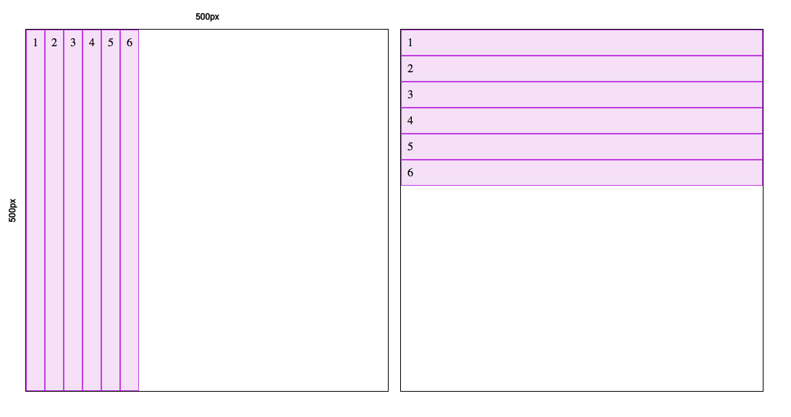
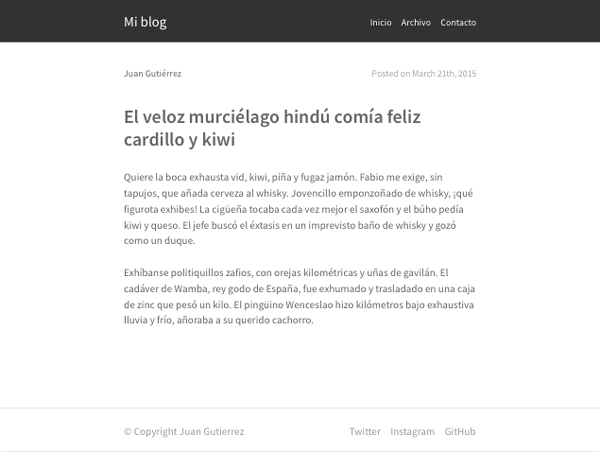

## EXERCISE 1 - FLEX y FLEX DIRECTION
Example:

1. Create a flex container of 500px for 500px and with 6 or more elements.
2. Have them distributed horizontally or vertically
3. Indicate which is the main axis

## EXERCISE 2 - FLEX Wrap

- Having a list of 10 to 15 images of 200x100 px, make a flexbox block where the images are distributed along the horizontal axis and are stacked one behind the other.

## EXERCISE 3 JUSTIFY CONTENT y ALIGN ITEMS

Example:

1. Make a horizontal menu with a flex container of 100px high
2. The menu options will be:
    - home
    - Projects
    - Team
    - Blog
    - Contact
3. Have them spread horizontally occupying all the available space, the first option is 20px from the left edge, and the last one is 20px from the right edge
4. All texts should appear centered vertically in the 100px container
5. The remaining space should be used to separate the menu options, one from the other

## EXERCISE 4 Order

Example:

1. Make a news list with image, title and content paragraph
2. Put them in a flex container and have them distributed in two columns
Choose a news, for example, the last one, and put it as highlighted, first and occupying the two columns

## EXERCISE 5 FLEX/GROW/SHRINK/BASIS

Example:

- Make a page with header, main and footer and make that even if there is little content the footer is always below the page and the main occupies all the available space. If there was a lot of content, the footer should be placed behind the main, naturally.

## EXERCISE 6

Example:

Convert the previous image to code using HTML and CSS and what you learned today from Flexbox. The requirements are the following:
- The measurements have to be relative, that is, the elements of the page must adapt to the width of the web browser window. If the size of the window increases, the size of the elements should increase.
- The width of the whole set must be 100% with a maximum width of 960px
- Each block must be created with an HTML5 tag (header, footer, aside ...) and must have a title that is centered (as it appears in the image). The central block (that would be an article), instead of having a title, will have a paragraph with a random text, you can write inside it what you want.

## EXERCISE 7

Example:

Convert the previous image to code using HTML and CSS and what you learned today from Flexbox. The requirements are the following:
- In this case if the size of the window increases only the size of the central block will increase, the gray block on the left and the group that composes the score, text and star on the right will always have the same size (example below)
- The width of the whole set must be 100% with a maximum width of 840px
- For the gray block on the left you should look for a square image and place it there
- Do not worry about the size of each element, the important thing is that the result has a similar composition
- To round the edges you must use border-radius with units in pixels (for example, border-radius: 5px)

## EXERCISE 8

- Create a page with a simple centered text that occupies 100% of the screen up to a maximum of 600 pixels. This text must have a title, an author and a creation date organized in the following way.
- It must also have a header with a background that occupies the entire screen and a content that occupies the same width as the text. In turn, you must also have a footer that sticks to the bottom of the page. When there is little text will remain there and when it appears much more text will go down, always at the end of the page.

Example of the page when the text is long

Example of the page when the text is short

references: [adalab-flexbox](https://books.adalab.es/materiales-front-end-e/sprint-1.-hola-mundo/1_4_posicionamiento_con_flexbox)
