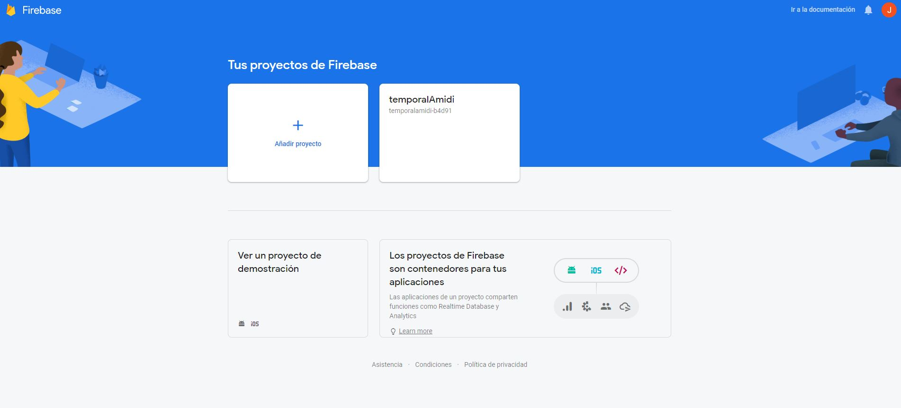
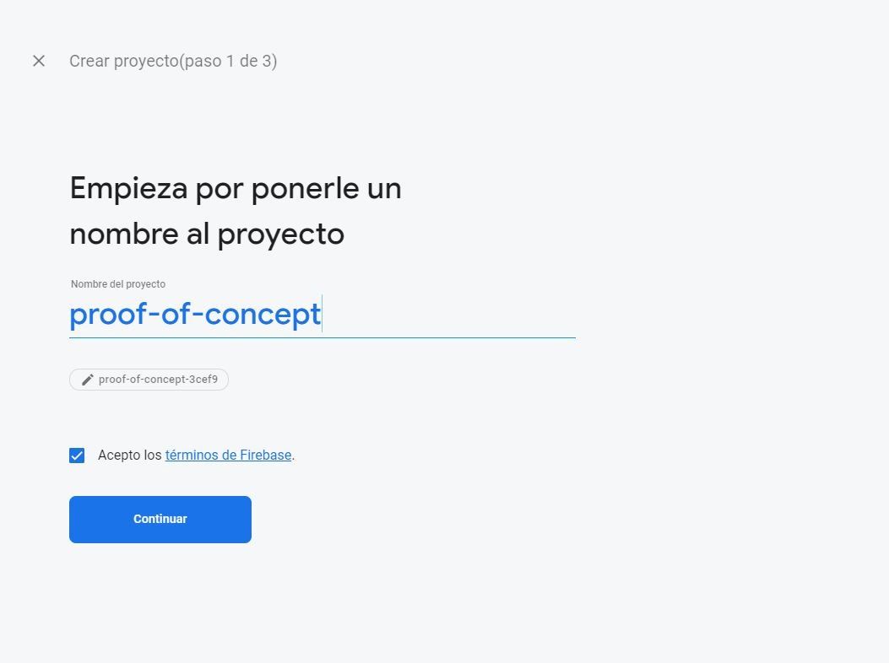
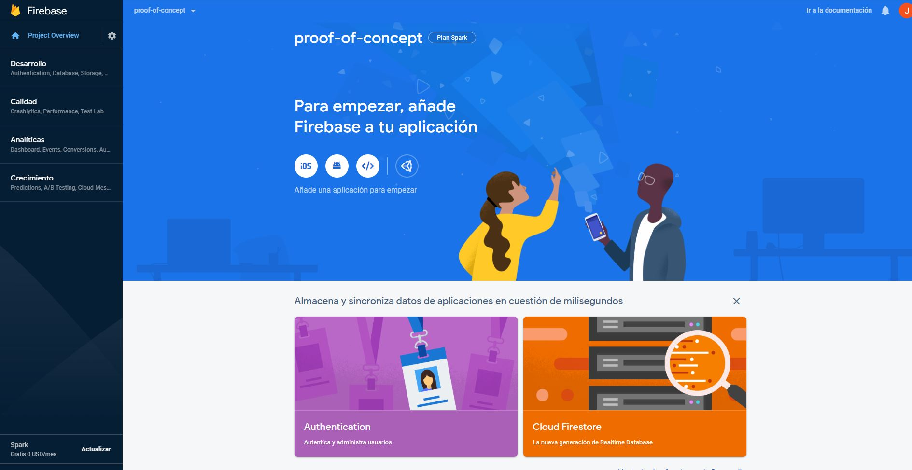
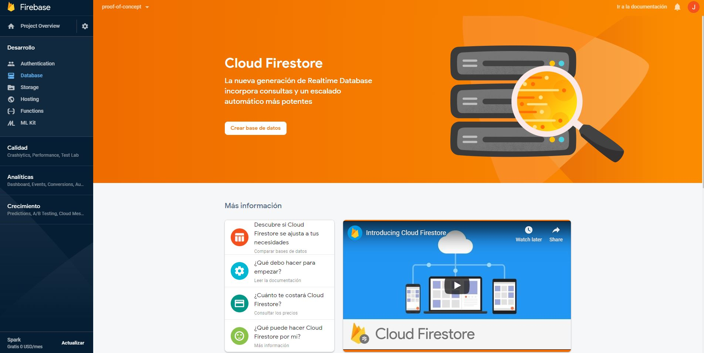
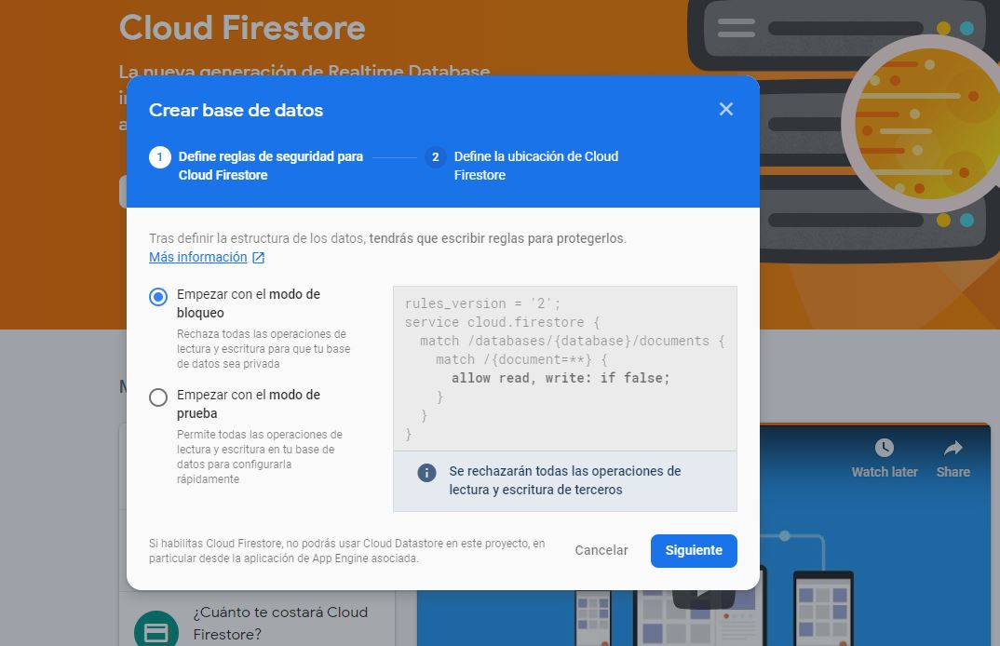

Exercises to work with api.
The material of that exercise comes in part from books.adalab.es


## Exercise 1 | Random number
Let's play a little with the codepen code of the previous example. Looking at the documentation of 'rand.fun', we will ask for an integer (integer).

Can we play by adding parameters to the URL of the key type = value, always after character? and separated by &, for example if you wanted to request a string with a certain length, the url would look like this

https://api.rand.fun/text/password?length=20

### Random Dog | Complete example of a fetch request
[Codepen Example](https://codepen.io/adalab/pen/oqQNvK?editors=1010)

```javascript

fetch('https://dog.ceo/api/breeds/image/random')
  .then(response => response.json())
  .then(data => {
    const img = document.querySelector('img');
    img.src = data.message;
    img.alt = 'Un perro';
  });

```

### Exercise 2 | Chihuahuas, Chihuahuas everywhere

Let's keep playing with the [Dog API](https://dog.ceo/dog-api/):

a)  We are going to modify the previous example so that the photos of our page only appear dogs of the Chihuahua breed.

b)  We will encapsulate all the logic to create a request in a function. We add a button to the page with the title 'Show me another Chihuahua' so that when pressed, another request is made to the server of a random image and a new image of Chihuaua appears.


### Exercise 3 | Github User

Now we are going to explore a new API: [the GitHub user API](https://developer.github.com/v3/users/).
The URL of this API is https://api.github.com/users/{username}, where {username} is the name of the user on GitHub. For example, here is the URL to obtain Isra user information https://api.github.com/users/gootyfer. If you put this URL in a new browser tab you can see what data the API returns.
We are going to create a page with a text input and a search button. The user will enter a GitHub username in the input. We will prepare a function that will be executed when the search button is pressed and that contains a request to the API to obtain information from that user and thus display it on our page:
- first name
- number of repositories
- avatar (image)

### Exercise 4 | Github User no Found
Now, use the .catch for show a message when doesn't exist the user.

catch documentation: https://developer.mozilla.org/en-US/docs/Web/API/Fetch_API/Using_Fetch

Cacth Example 
```javascript
fetch('https://jsonplaceholder.typicode.com/404')
  .then(res => {
    if(res.ok) {
      return res.json();
    } else {
      throw Error(`Request rejected with status ${res.status}`);
    }
  })
  .catch(console.error)
```

### Exercise 5 | Github Repository list

List of repos of an organization in Github
We will continue exploring the GitHub API by exploring the part of the API to access the information about organizations. The URL of this API is https://api.github.com/orgs/${orgname}/repos, where {orgname} is the name of the organization on GitHub. For example, here you have the URL to obtain information from the Adalab organization https://api.github.com/orgs/Adalab. If you put this URL in a new browser tab you can see what data the API returns.
The objective of this exercise is to display on a website the complete list of repositories of an organization that are created in GitHub.

### Exercise 6 | Method post
Look and reply the next example. This is a  fetch with post method.
This api is a fake. But in the real world this method save information.
When we send information with post we use body for send information by secure way.
And we use the header for send information about the information how the format **'application/json'**.


``` javascript
 const myPost = {
        title: 'A post about true facts',
        body: 'Once upon a time.....',
        userId: 8888888887
    };

    fetch('https://jsonplaceholder.typicode.com/posts', {
        method: 'POST',
        body: JSON.stringify(myPost),
        headers: {
            'Content-Type': 'application/json'
        }
    })
    .then(response => response.json())
    .then(data => {
        console.log("---------- we save our information -----------")
    });

    fetch(`https://jsonplaceholder.typicode.com/post/${myPost.userId}`)
        .then(response => response.json())
        .then(data => {
            console.log("---------- we recover our information -----------");
            console.log(data);
        });
```

### Exercise 7 | Extra Exercise, Real Example

Firebase is one platform where we can host static web page and little json data base and more.

Now we'll use firebase a json database for save our own information.

- First step. We go to https://firebase.google.com.
And we create a free count. We can entry with a google count.

- Second step. In the console we'll create a new proyect.
When we ask by google analytics we click "now no".






Now we have a proyect in firebase.



- Third step. We go to Develoment -> Database and we create a Database.



- Fourth step. we selecte block mode. Only can read but only you can write,



- Fifth step. Create a file with name users.json and add the next data.

```
[
  {
    "id": 1,
    "name": "Leanne Graham",
    "username": "Bret",
    "email": "Sincere@april.biz",
    "address": {
      "street": "Kulas Light",
      "suite": "Apt. 556",
      "city": "Gwenborough",
      "zipcode": "92998-3874",
      "geo": {
        "lat": "-37.3159",
        "lng": "81.1496"
      }
    },
    "phone": "1-770-736-8031 x56442",
    "website": "hildegard.org",
    "company": {
      "name": "Romaguera-Crona",
      "catchPhrase": "Multi-layered client-server neural-net",
      "bs": "harness real-time e-markets"
    }
  },
  {
    "id": 2,
    "name": "Ervin Howell",
    "username": "Antonette",
    "email": "Shanna@melissa.tv",
    "address": {
      "street": "Victor Plains",
      "suite": "Suite 879",
      "city": "Wisokyburgh",
      "zipcode": "90566-7771",
      "geo": {
        "lat": "-43.9509",
        "lng": "-34.4618"
      }
    },
    "phone": "010-692-6593 x09125",
    "website": "anastasia.net",
    "company": {
      "name": "Deckow-Crist",
      "catchPhrase": "Proactive didactic contingency",
      "bs": "synergize scalable supply-chains"
    }
  },
  {
    "id": 3,
    "name": "Clementine Bauch",
    "username": "Samantha",
    "email": "Nathan@yesenia.net",
    "address": {
      "street": "Douglas Extension",
      "suite": "Suite 847",
      "city": "McKenziehaven",
      "zipcode": "59590-4157",
      "geo": {
        "lat": "-68.6102",
        "lng": "-47.0653"
      }
    },
    "phone": "1-463-123-4447",
    "website": "ramiro.info",
    "company": {
      "name": "Romaguera-Jacobson",
      "catchPhrase": "Face to face bifurcated interface",
      "bs": "e-enable strategic applications"
    }
  },
  {
    "id": 4,
    "name": "Patricia Lebsack",
    "username": "Karianne",
    "email": "Julianne.OConner@kory.org",
    "address": {
      "street": "Hoeger Mall",
      "suite": "Apt. 692",
      "city": "South Elvis",
      "zipcode": "53919-4257",
      "geo": {
        "lat": "29.4572",
        "lng": "-164.2990"
      }
    },
    "phone": "493-170-9623 x156",
    "website": "kale.biz",
    "company": {
      "name": "Robel-Corkery",
      "catchPhrase": "Multi-tiered zero tolerance productivity",
      "bs": "transition cutting-edge web services"
    }
  },
  {
    "id": 5,
    "name": "Chelsey Dietrich",
    "username": "Kamren",
    "email": "Lucio_Hettinger@annie.ca",
    "address": {
      "street": "Skiles Walks",
      "suite": "Suite 351",
      "city": "Roscoeview",
      "zipcode": "33263",
      "geo": {
        "lat": "-31.8129",
        "lng": "62.5342"
      }
    },
    "phone": "(254)954-1289",
    "website": "demarco.info",
    "company": {
      "name": "Keebler LLC",
      "catchPhrase": "User-centric fault-tolerant solution",
      "bs": "revolutionize end-to-end systems"
    }
  },
  {
    "id": 6,
    "name": "Mrs. Dennis Schulist",
    "username": "Leopoldo_Corkery",
    "email": "Karley_Dach@jasper.info",
    "address": {
      "street": "Norberto Crossing",
      "suite": "Apt. 950",
      "city": "South Christy",
      "zipcode": "23505-1337",
      "geo": {
        "lat": "-71.4197",
        "lng": "71.7478"
      }
    },
    "phone": "1-477-935-8478 x6430",
    "website": "ola.org",
    "company": {
      "name": "Considine-Lockman",
      "catchPhrase": "Synchronised bottom-line interface",
      "bs": "e-enable innovative applications"
    }
  },
  {
    "id": 7,
    "name": "Kurtis Weissnat",
    "username": "Elwyn.Skiles",
    "email": "Telly.Hoeger@billy.biz",
    "address": {
      "street": "Rex Trail",
      "suite": "Suite 280",
      "city": "Howemouth",
      "zipcode": "58804-1099",
      "geo": {
        "lat": "24.8918",
        "lng": "21.8984"
      }
    },
    "phone": "210.067.6132",
    "website": "elvis.io",
    "company": {
      "name": "Johns Group",
      "catchPhrase": "Configurable multimedia task-force",
      "bs": "generate enterprise e-tailers"
    }
  },
  {
    "id": 8,
    "name": "Nicholas Runolfsdottir V",
    "username": "Maxime_Nienow",
    "email": "Sherwood@rosamond.me",
    "address": {
      "street": "Ellsworth Summit",
      "suite": "Suite 729",
      "city": "Aliyaview",
      "zipcode": "45169",
      "geo": {
        "lat": "-14.3990",
        "lng": "-120.7677"
      }
    },
    "phone": "586.493.6943 x140",
    "website": "jacynthe.com",
    "company": {
      "name": "Abernathy Group",
      "catchPhrase": "Implemented secondary concept",
      "bs": "e-enable extensible e-tailers"
    }
  },
  {
    "id": 9,
    "name": "Glenna Reichert",
    "username": "Delphine",
    "email": "Chaim_McDermott@dana.io",
    "address": {
      "street": "Dayna Park",
      "suite": "Suite 449",
      "city": "Bartholomebury",
      "zipcode": "76495-3109",
      "geo": {
        "lat": "24.6463",
        "lng": "-168.8889"
      }
    },
    "phone": "(775)976-6794 x41206",
    "website": "conrad.com",
    "company": {
      "name": "Yost and Sons",
      "catchPhrase": "Switchable contextually-based project",
      "bs": "aggregate real-time technologies"
    }
  },
  {
    "id": 10,
    "name": "Clementina DuBuque",
    "username": "Moriah.Stanton",
    "email": "Rey.Padberg@karina.biz",
    "address": {
      "street": "Kattie Turnpike",
      "suite": "Suite 198",
      "city": "Lebsackbury",
      "zipcode": "31428-2261",
      "geo": {
        "lat": "-38.2386",
        "lng": "57.2232"
      }
    },
    "phone": "024-648-3804",
    "website": "ambrose.net",
    "company": {
      "name": "Hoeger LLC",
      "catchPhrase": "Centralized empowering task-force",
      "bs": "target end-to-end models"
    }
  }
]
```


- Sixth step. We import the json within path /user.
For this write the right path and after import the users.json file.


- Seventh step. Now you are ready.You use fetch for access your api


